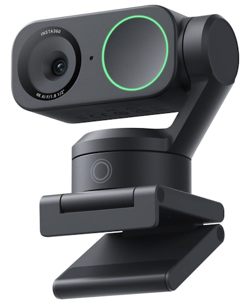

# OpenC3 COSMOS UVC Plugin

<p align="center">
  
</p>

Control USB Video Class (UVC) webcams from COSMOS. Generic UVC standard controls (PTZ, brightness, contrast, etc.) work with any compliant camera. Insta360 Link / Link 2 vendor controls (AI tracking, scene modes, framing, target) are gated by a plugin variable.

Tested on **macOS**

## Architecture

```
control:  COSMOS plugin --TCP--> openc3pycli bridge --libusb--> Camera
video:    COSMOS videoplayer <--HLS-- MediaMTX <--RTSP-- ffmpeg <-- Camera
```

The two paths coexist: the bridge does USB control transfers without claiming any interface; ffmpeg uses AVFoundation streaming. macOS needs `sudo` to run the bridge (Apple holds the camera kext).

---

## 1. Install dependencies (macOS)

```bash
brew install libusb ffmpeg mediamtx
python3 -m venv .venv && source .venv/bin/activate
pip install openc3 pyusb
gem install openc3
```

## 2. Build + install the plugin

```bash
rake build VERSION=1.0.0
```

In the COSMOS Admin Tool > Plugins, upload `openc3-cosmos-uvc-1.0.0.gem`.

## 3. Run the control bridge

```bash
sudo -E .venv/bin/python run_bridge.py vendor_id=0x2E1A product_id=0x4C04 router_port=8080
```

Defaults are Insta360 Link 2. Set `vendor_id=nil product_id=nil` to auto-detect any Insta360 Link.

Now PTZ and image commands work in Command Sender / Script Runner.

## 4. Live video into COSMOS

Three terminals:

```bash
# Terminal A: stream server
mediamtx mediamtx.yml

# Terminal B: push camera to server
./stream.sh
```

Install Video Player via the COSMOS Admin Tool. In the VideoPlayer tool: **File > New Source** → `http://localhost:8888/insta360/index.m3u8`

---

## Plugin Variables

| Variable                 | Default                  | Purpose                                                          |
|--------------------------|--------------------------|------------------------------------------------------------------|
| `uvc_target_name`        | `UVC`                    | Target name                                                      |
| `uvc_bridge_host`        | `host.docker.internal`   | Host running the bridge                                          |
| `uvc_bridge_port`        | `8080`                   | TCP port the bridge listens on                                   |
| `uvc_insta360_enabled`   | `true`                   | Include Insta360 XU commands + screen section                    |

## Wire Format

```
[ SYNC u16 = 0xAABB ][ LEN u16 ][ PKT_ID u8 ][ PAYLOAD... ]
```

| ID    | Name          | Payload                                                                | COSMOS COMMANDs                                                                 |
|-------|---------------|------------------------------------------------------------------------|---------------------------------------------------------------------------------|
| 0x01  | SET_CTRL      | `u8 UNIT, u8 SEL, u8 LEN, u8 SIGNED, i64 VALUE`                        | `ZOOM`, `BRIGHTNESS`, `CONTRAST`, `SATURATION`, `SHARPNESS`, `SCENE_MODE`*, `TRACKING_FRAME`*, `TRACKING_TARGET`* |
| 0x02  | SET_PANTILT   | `i32 PAN, i32 TILT`                                                    | `PAN_TILT`                                                                       |
| 0x03  | GIMBAL_RESET  | (none)                                                                 | `GIMBAL_RESET`                                                                   |

\* Insta360-only

## Script API

```python
load_utility('UVC/lib/uvc.py')
cam = Uvc()
cam.zoom(250)
cam.pan_tilt(1500, -300)
cam.brightness(50)
cam.scene_mode("AI_TRACKING")   # Insta360 only
cam.tracking_frame("HALF_BODY") # Insta360 only
```

Demo procedures in `targets/UVC/procedures/`: `procedure.py` (general sweep), `zigzag.py` (row-by-row PTZ pattern).

## License

MIT — see [LICENSE.txt](LICENSE.txt).
